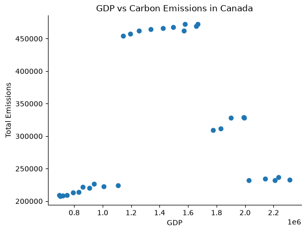
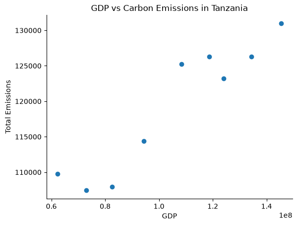
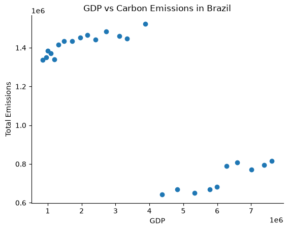
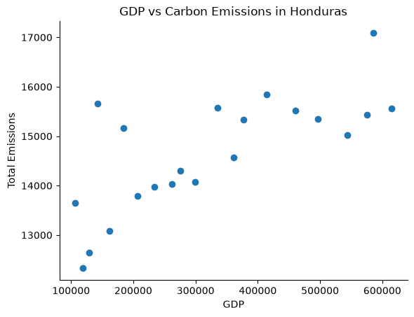
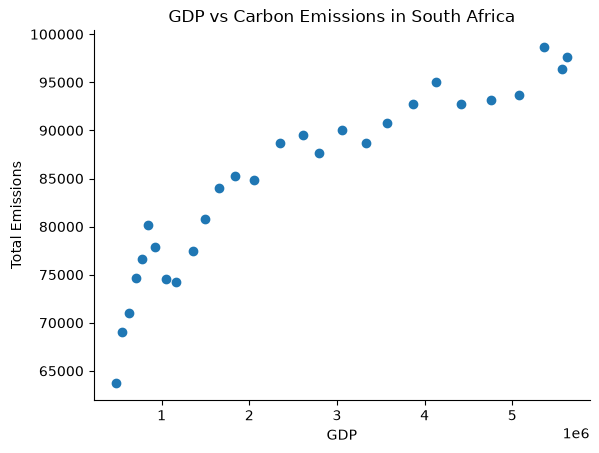
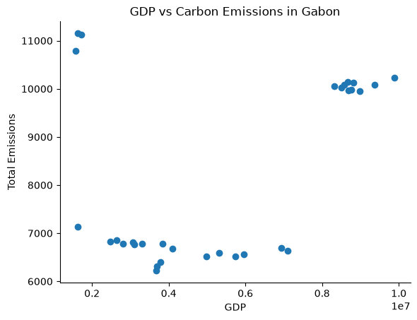
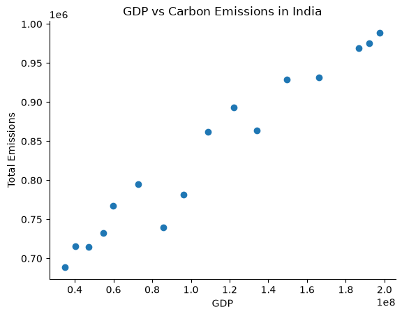
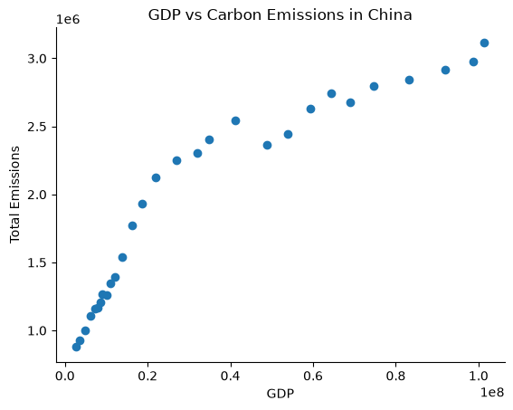

# Test Driven Development
This repository contains code for reading carbon emission and GDP data, aligning it by year, and creating scatter plots of the data. You can use it to examine relationships between GDP and different sources of emissions for various countries.

## Installation and set up
First, open your Terminal and navigate to the directory that you want this repository to be located in. Then clone the repository by running
```
git clone https://github.com/maiakrd98/test-driven-development.git
```

Next, navigate to the `test-driven-development` folder by running 
```
cd test-driven-development
```

Here, you will see all the files in the repository.

To set up the environment, first run this code to create the environment:
```
mamba env create -f environment.yml
```
Then activate the environment by running
```
mamba activate swe4s
```

This environment contains `pycodestyle` for checking that python code is compliant with the PEP 8 style guide, `wget` for running the functional test file, and `matplotlib` for plotting.

Next, run
```
curl -L "https://docs.google.com/uc?export=download&id=1AsXP_OGs1O_TDeXiZjk3fYV1SrG4vwXF" -o data/Agrofood_co2_emission.csv
curl -L "https://docs.google.com/uc?export=download&id=19YEPysdnK7VCXuAe9Og9pwYkNT5CbQzr" -o data/IMF_GDP.csv
```
to import the required data files (which are not committed to the repository because they are too big).

## Data file information
`Agrofood_co2_emission.csv` is a comma separated file with countries listed in the first column, years listed in the second column, and corresponding greenhouse gas emmissions from various sources listed in the remaining columns. It should be located in the `data` directory (which the commands above should automatically take care of). `IMF_GDP.csv` should also be located in the `data` directory and is a comma separated file with countries in the first column and their GDPs in the years between 1950 and 2022 in the remaining columns. Both files have some blank entries, which indicate missing data for that country and year.

This repository also contains two small data files called `Agrofood_co2_emission_test.csv` and `IMF_GDP_test.csv` in `test/data` that are smaller versions of `Agrofood_co2_emission.csv` and `IMF_GDP.csv` and are used in testing.

## Code function and testing instructions

`fire_gdp.py` contains three functions:
- `get_data(file_name, query_column=None, query_value=None, return_header=False)` returns rows from a data file as strings. If a query column and value are given, it returns only the rows where the string in that column matches the value. If `return_header` is `True`, it also return the header.
- `get_column_index(header, column_name)` returns the position of a column name in a header list. If the name is not in the header, it returns `None`.
- `get_fire_gdp_year_data(co2_file, gdp_file, country, emission_col_name="Forest fires")` combines emissions and GDP for one country by matching years and returns a list of `[year, emissions, gdp]` entries. If `emission_col_name` is provided, it returns that emission type, otherwise it returns forest fire emissions.

To run the unit tests to check that these functions are working correctly, run the following command from the main directory of the repository
```
python -m unittest discover -s test/unit
```

`plot_fire_gdp.py` takes seven command line arguments: `--co2_file`, `--gdp_file`, `--out_file`, `--title`, `--y_variable`, `--y_axis_label`, and `--country`. Using the functions in `fire_gdp.py` and data from `co2_file` and `gdp_file`, this file creates a scatterplot of GDP on the x-axis vs `y_variable` (which should be a header of `co2_file`) on the y-axis for the given `country`. The plot is titled `title` and the y-axis is labeled with `y_axis_label`. The plot is saved to the path given in `out_file`.

Examples of running `plot_fire_gdp.py` are in the following section.

To run the functional tests, which check that `plot_fire_gdp.py` is working, run the following command from the main directory of the repository
```
bash test/func/test_fire_gdp.sh
```

These tests also run automatically as a github action anytime you push to the remote repository or submit a pull request. This is controlled through the `test.yml` file in the `.github/workflows` directory.

## Exploring the relationship between GDP and emissions

### Introduction
We will analyze the relationship between a country's gross domestic product (GDP) and its total carbon emissions by year. Since each country's GDP is in a different currency, they are not directly comparable, so we will examine several countries individually. I hypothesize that GDP and total carbon emissions will have a positive relationship, especially for lower-income countries whose economies (at least in some cases) are growing partly by becoming more industrialized and releasing more emissions. We will look at Canada, Tanzania, Brazil, Honduras, South Africa, Gabon, India, and China. 

### Results



Canada does not appear to have a straightforword relationship between GDP and carbon emissions. There are several different clusters of data points and within each one there seems to be a slight positive relationship between GDP and total emissions, but those overall there is not a clear relationship.



Although there are fewer years of data for Tanzania, it has a strong positive relation relationship between GDP and total carbon emissions. This fits with our hypothesis.



Like Canada, Brazil has clusters of data and within each one there seems to be a  positive relationship between GDP and total emissions. However the cluster with overall higher GDP has lower overall emissions, which complicates the relationship.



Honduras has a positive relationship between GDP and carbon emissions, although it is more noisy than Tanzania's. This also its with our hypothesis.



South Africa has a clear positive relationship between GDP and total carbon emissions, which supports our hypothesis. However, it doesn't appear to be fully linear, but rather starts to level out at higher GDP values.



Gabon does not have a straightforward relationship between GDP and carbon emissions.



India has a positive relationship between GDP and total carbon emissions, which appears to be roughly linear. This supports our hypothesis. 



China has a positive relationship between GDP and total carbon emissions, but like South Africa the relationship becomes less steep at higher GDP values. This also supports our hypothesis.

Overall, some countries (Tanzania, Honduras, South Africa, India, China) have clear positive relationships between GDP and total carbon relationships, while others (Canada, Brazil, Gabon) have more complicated relationships. Therefore, while our hypothesis has some support, the situation is more complicated. 

### Methods

To analyze the data, I aligned GDP and total emission data by year and created scatter plots of that data using `src/plot_fire_gdp.py`. To create each plot, run the following commands.  

Canada:
```
python src/plot_fire_gdp.py \
    --co2_file 'data/Agrofood_co2_emission.csv' \
    --gdp_file 'data/IMF_GDP.csv' \
    --out_file 'plots/canada_gdp_emissions.png' \
    --title 'GDP vs Carbon Emissions in Canada' \
    --y_axis_label 'Total Emissions' \
    --y_variable 'total_emission' \
    --country 'Canada'
```

Tanzania:
```
python src/plot_fire_gdp.py \
    --co2_file 'data/Agrofood_co2_emission.csv' \
    --gdp_file 'data/IMF_GDP.csv' \
    --out_file 'plots/tanzania_gdp_emissions.png' \
    --title 'GDP vs Carbon Emissions in Tanzania' \
    --y_axis_label 'Total Emissions' \
    --y_variable 'total_emission' \
    --country 'United Republic of Tanzania'
```

Brazil:
```
python src/plot_fire_gdp.py \
    --co2_file 'data/Agrofood_co2_emission.csv' \
    --gdp_file 'data/IMF_GDP.csv' \
    --out_file 'plots/brazil_gdp_emissions.png' \
    --title 'GDP vs Carbon Emissions in Brazil' \
    --y_axis_label 'Total Emissions' \
    --y_variable 'total_emission' \
    --country 'Brazil'
```

Honduras:
```
python src/plot_fire_gdp.py \
    --co2_file 'data/Agrofood_co2_emission.csv' \
    --gdp_file 'data/IMF_GDP.csv' \
    --out_file 'plots/honduras_gdp_emissions.png' \
    --title 'GDP vs Carbon Emissions in Honduras' \
    --y_axis_label 'Total Emissions' \
    --y_variable 'total_emission' \
    --country 'Honduras'
```

South Africa:
```
python src/plot_fire_gdp.py \
    --co2_file 'data/Agrofood_co2_emission.csv' \
    --gdp_file 'data/IMF_GDP.csv' \
    --out_file 'plots/south_africa_gdp_emissions.png' \
    --title 'GDP vs Carbon Emissions in South Africa' \
    --y_axis_label 'Total Emissions' \
    --y_variable 'total_emission' \
    --country 'South Africa'
```

Gabon:
```
python src/plot_fire_gdp.py \
    --co2_file 'data/Agrofood_co2_emission.csv' \
    --gdp_file 'data/IMF_GDP.csv' \
    --out_file 'plots/gabon_gdp_emissions.png' \
    --title 'GDP vs Carbon Emissions in Gabon' \
    --y_axis_label 'Total Emissions' \
    --y_variable 'total_emission' \
    --country 'Gabon'
```

India:
```
python src/plot_fire_gdp.py \
    --co2_file 'data/Agrofood_co2_emission.csv' \
    --gdp_file 'data/IMF_GDP.csv' \
    --out_file 'plots/india_gdp_emissions.png' \
    --title 'GDP vs Carbon Emissions in India' \
    --y_axis_label 'Total Emissions' \
    --y_variable 'total_emission' \
    --country 'India'
```

China:
```
python src/plot_fire_gdp.py \
    --co2_file 'data/Agrofood_co2_emission.csv' \
    --gdp_file 'data/IMF_GDP.csv' \
    --out_file 'plots/china_gdp_emissions.png' \
    --title 'GDP vs Carbon Emissions in China' \
    --y_axis_label 'Total Emissions' \
    --y_variable 'total_emission' \
    --country 'China'
```